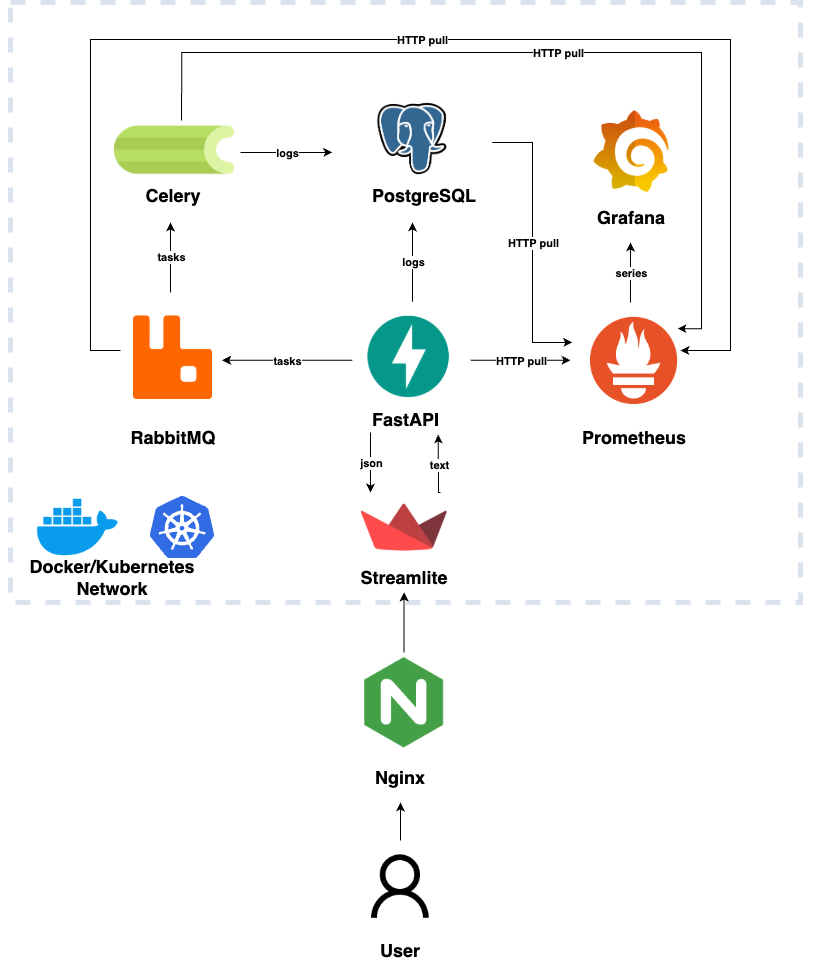
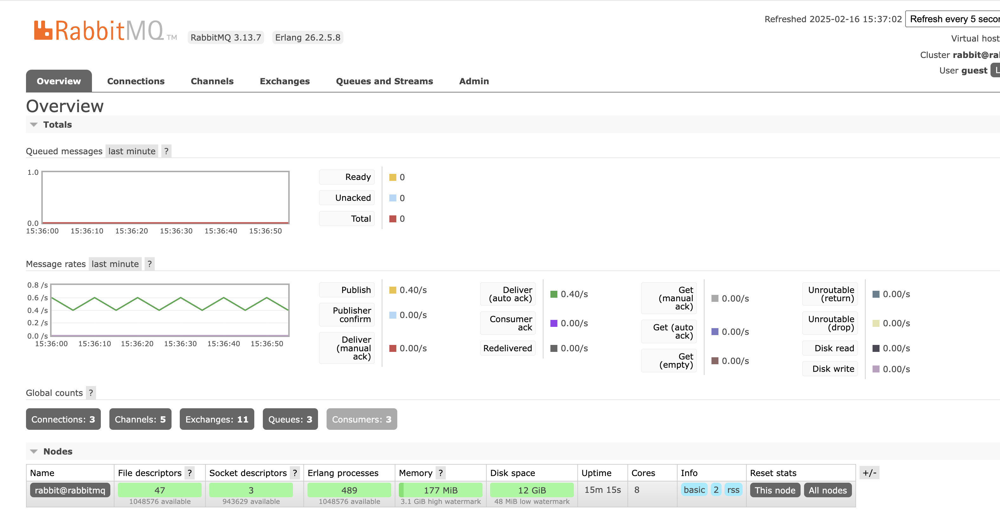

# comments_summary

Проект по саммаризации и извлечению ключевых слов из отзывов покупателей на товары.

## TODO
- добавить стримлит
- добавить ручку по извлечению атрибутов и их характеристик 
- добавить vllm как отдельный сервис в докер компоуз и переписать/дописать ручки с ним 
- собрать все константы в конфиг 


## Схема сервиса 


## ключевые потоки данных

    ```bash
    Пользователь → nginx (80/443)
        ├─ /streamlit/*  → streamlit (форма)
        │    └─ POST /api/reviews → app
        │        ├─ INSERT → Postgres
        │        └─ publish → RabbitMQ
        ├─ /api/*        → app (FastAPI)
        │    └─ JSON ответ → Streamlit UI
        └─ /static/*     → static_server (картинки)

    celery_worker ← RabbitMQ  → app
    celery_worker → Postgres
    Prometheus — pull → {app, worker, RabbitMQ, Postgres}
    Grafana — pull → Prometheus
    ```
## структура проекта

### app/
-  **main.py**: FastAPI-приложения; здесь создаётся экземпляр приложения и подключаются роутеры
- **api.py**: определение API-эндпоинтов для суммаризации отзывов, извлечения ключевых слов и запуска асинхронного инференса
- **models.py**: функции-обёртки для вызова моделей (суммаризация, извлечение ключевых слов)
- **tasks.py**: определение задач для Celery (асинхронный инференс и обновление статусов в БД??? TODO: подумать как следует)
- **database.py**: подключение и работа с PostgreSQL (логирование обращений, обновление статусов задач)
- **config.py**: конфиг проекта (настройки, переменные окружения, параметры подключения к БД и брокеру сообщений). локально храним в .env, потом надо сделать yaml файлы (TODO: ci/cd кажется удобней в гитлабе, чем в гитхабе, возможно перееду)

### streamlit_app/
- **app.py**: Визуальное представление результатов обработки отзывов с использованием Streamlit.

### static/  
Статические файлы (просто картинка кота, потом добавлю в стримлит)
- cat.jpg

### nginx/
 - **nginx.conf**         # конфиг nginx для reverse proxy, маршрутизации запросов к API и отдавания статики

###  docker/
- **dockerfile.app**: докер для сборки образа FastAPI-приложения (uvicorn).
- **dockerfile.streamlit**: докер для сборки образа Streamlit визуала.

### research/
- BERTopic.ipynb - ноутбук с разными вариантами предобработки и разделения на топики текстов (после использования vllm, эта часть стала самой долгой)
- openai_dataset_gen.ipynb - генерация синтетической разметки для атрибутов и их характеристик с помощью gpt-4o. Задача не решалась с помощью подбора промптов, в итоге был создан датасет на 10к записей и на нем было сделано дообучение моделей 
- lora.ipynb - ноутбук с дообучением, модель из семейства Вихрь. Также были протестированы и другие модели (сайга, deepseek), но качество генерации хуже (субъективное мнение)
- vll_test.ipynb -  примеры как работает vllm и как его надо запускать для теста + bash скрипты и описание как тестировать разные промпты и гиперпараметры быстро

### k8s/
- secrets.yaml
- pvc.yaml
- postgres.yaml
- rabbitmq.yaml
- app.yaml
- worker.yaml
- flower.yaml
- static.yaml
- ingress.yaml


### root/ 
- **docker-compose.yml**: определение всех необходимых сервисов (API, Celery, Streamlit, PostgreSQL, RabbitMQ/Redis???, Nginx) для развёртывания проекта.
- **requirements.txt**: пакеты python (FastAPI, uvicorn, celery, SQLAlchemy, psycopg2, и т.п.)
- **README.md**: описание проекта, инструкция по запуску и настройке

## Установка

1. Клонировать репозиторий:
   ```bash
   git clone git@github.com:DariaMishina/comments_summary.git
   cd comments_summary
   ```

2. для запуска в docker
- создаем docker образ
    ```bash
    docker build -t comments_summary_app:latest -f docker/Dockerfile.app .
    ```
- запускаем docker контейнер (порт 8000 для мэппинга выбран произвольно)
    ```bash
    docker run -p 8000:8000 comments_summary_app:latest
    ```

3. __docker compose__

   Добавила БД для хранения логов вызова микросервиса, теперь нужен docker compose
- собраем образ перед запуском
    ```bash
    docker compose build
    ```
- запускаем все вместе в фоновом режиме (-d):
    ```bash
    docker compose up -d
    ```
- SQLAlchemy создает таблицы:
    ```bash
    docker exec -it my_app python -c "from app.database import Base, engine; Base.metadata.create_all(engine)"
    ```
- проверяем появилась ли таблица в PostgreSQL:
    ```bash
    docker exec -it postgres_db psql -U user -d mydatabase -c "SELECT tablename FROM pg_catalog.pg_tables WHERE schemaname = 'public';"
    ```
- дальше стучимся в сервис (см curl`ы ниже) и проверяем появляются ли записи в таблице 
    ```bash
    docker exec -it postgres_db psql -U user -d mydatabase -c "SELECT * FROM request_logs LIMIT 10;"
    ```
- если что-то пошло не так, что можно удалить БД и запустить заново (-v удалит все данные в БД! но на этапе теста там того и надо) 
  ```bash
    docker compose down -v
    ```

4. __curl для проверки эндпоинтов__

1) самая простецкая ручка - просто для проверки сервиса
    ```bash
    curl -X GET "http://127.0.0.1:8000/ping"
    ```
2) для ключевых слов
    ```bash
    curl -X POST "http://127.0.0.1:8000/keywords" \
     -H "Content-Type: application/json" \
     -d '{
           "text": "Купил арбуз, он был спелым, сочным и с приятной сладостью, что приятно удивило.\nАрбуз оказался неравномерно спелым: одна половина слишком твердая, другая — мягкая, но вкус всё равно хороший.\nПри покупке для пикника выбрал арбуз, который порадовал насыщенным ароматом и отличной текстурой мякоти.\nНе впечатлил арбуз: мякоть оказалась водянистой, а сладость была недостаточной, несмотря на красивую кожуру.\nОтличный арбуз: насыщенный цвет, идеальный баланс сладости и лёгкой кислинки – настоящий летний десерт."
         }'
    ```
3) для саммари - если нет GPU, будет сюрприз 
    ```bash
    curl -X POST "http://127.0.0.1:8000/summarize" \
     -H "Content-Type: application/json" \
     -d '{
           "text": "Купил арбуз, он был спелым, сочным и с приятной сладостью, что приятно удивило.\nАрбуз оказался неравномерно спелым: одна половина слишком твердая, другая — мягкая, но вкус всё равно хороший.\nПри покупке для пикника выбрал арбуз, который порадовал насыщенным ароматом и отличной текстурой мякоти.\nНе впечатлил арбуз: мякоть оказалась водянистой, а сладость была недостаточной, несмотря на красивую кожуру.\nОтличный арбуз: насыщенный цвет, идеальный баланс сладости и лёгкой кислинки – настоящий летний десерт."
         }'
    ```
4) для эндпоинта с очередью (проверяем нашего rabbitmq и celery)
    ```bash
    curl -X POST "http://localhost:8000/huge_summarize" \
        -H "Content-Type: application/json" \
        -d '{
            "text": "Это пример очень большого количества отзывов, которые нужно обработать и сделать саммари"
            }'
    ```
    в ответе будет такое 
    ```bash
    {"task_id":"XXXX","status":"submitted"}
    ```
5) эндпоинт чтобы получать статусы по задачам из БД, где ХХХХ - это task_id
    ```bash
    curl -X GET "http://localhost:8000/XXXX"
    ```
    в результате если все ок должно быть такое 
    ```bash
    {"task_id":"XXXX","status":"completed"}
    ```

5. __Как открыть RabbitMQ в браузере и посмотреть состояние очередей__

    ```bash
    http://localhost:15672
    ```
    логин и пароль guest и должны увидедь что-то такое 


6. __Статика__

    можно даже не создавать БД, просто после запуска компоуз посмотреть картинку кота (не несет смысловой нагрузки, просто для выполнения задания)

    ```bash
    curl -i http://localhost/static/cat.jpg
    ```
    или сохранить ее 
    ```bash
    curl -o cat_saved.jpg http://localhost/static/cat.jpg
    ```
    или открыть в браузере
    ```bash
    http://localhost/static/cat.jpg
    ```

7. __Kubernetes__ (после очередного обновления MacOS подход немного поменялся)

    1. после установки minikube (brew install kubectl, brew install minikube на MacOS) запускаем кластер с драйвером docker:
        ```bash
        minikube start --driver=docker
        ```

    2. собираем и загружаем docker образ в minikube 
    Поскольку Minikube использует свою docker среду, нужно загрузить образ туда
        
        2.1. пересобираем Docker-образ
        ```bash
        docker build -t my-app:latest -f docker/Dockerfile.app .
        ```
        2.2. загружаем в minikube (может быть долго) 
        ```bash
        minikube image load my-app:latest --alsologtostderr -v=4
        ```
        2.3. проверяем что образ появился в minikube
        ```bash
        minikube ssh
        docker images
        ```
        
    3. Разверачиваем сервис в minikube:
        ```bash
        kubectl apply -f k8s/
        ```
        в другом терминале ключаем тунель:
        ```bash
        sudo minikube tunnel
        ```

        включаем ингресс (один раз, если не включали раньше):
        ```bash
        minikube addons enable ingress
        ```

        добавляем в /etc/hosts:
        ```bash
        127.0.0.1 app.local
        127.0.0.1 rabbit.local
        ```

        проверяем, что поды запустились:
        ```bash
        kubectl get pods
        ```
        проверяем, что сервисы созданы:
        ```bash
        kubectl get svc
        ```
        проверяем ингресс:
        ```bash
        kubectl get ingress
        ```


    4. Запускаем 
        проверяем с нашим простым эндпоинтом 
        ```bash
        curl http://app.local/ping
        ``` 

8. __Мониторинг__

    1. Повторяем шаги 1-3 из предыдущего пункта Kubernetes (кроме ингресса - вечные проблемы на маке с ним)
    2. открываем в браузере графану и прометей (ВАЖНО! не забыть про тунель и терминал с тунелем держать открытым или переделывать на Node Port)
        ```bash
        minikube service prometheus
        minikube service grafana
        ``` 
    3. Настройка Grafana
    - заходим в браузере в графану (должна была открыться страница в браузере на предыдущем шаге)
    - логин: admin, пароль: admin
    - переходим в Connections - Data Sources нажимем кнопку Add new data source и выбираем Prometheus
    - в поле Connection указываем урл http://prometheus:9090 
    - нажимаем кнопку Save & Test и должна появиться зелёная галочка 

    4. Импорт готового дашборда
    - нажимаем вверху слева на плюсик + и потом кнопку Import dashboard
    - указываем ID дашборда: FastAPI dashboard: 11074
    - нажимаем кнопку Load, выбираем источник данных Prometheus

    5. Проверка, что метрики приходят в Prometheus:
    - заходим в браузере в прометей (должна была открыться страница в браузере на 2м шаге)
    - в поиске указываем что-то типа  http_requests_total - это общее количество http-запросов к нашему приложению с группировками по методу (гет/пост), эндпоинту и статусу

